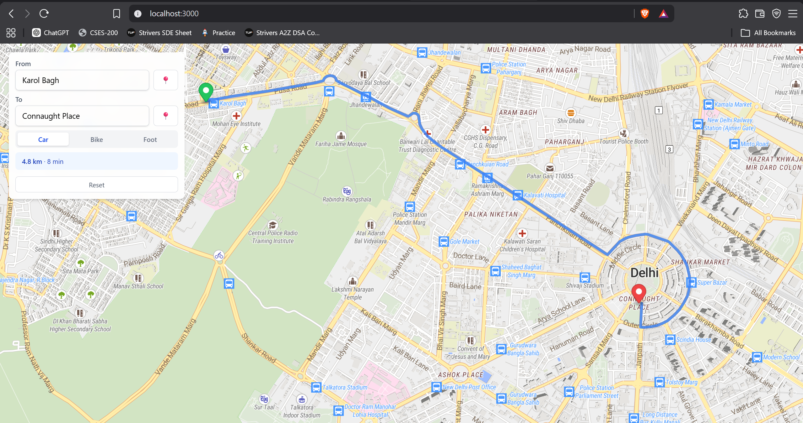

# Local Setup

## Prerequisites

- Node.js 20+
- Java 17+ (required for Planetiler)
- Python 3.13+
- Git

# Start the Default Project (Delhi Map)
```cmd
  Double click the ServiceManager.exe and wait
```

---

## Important Things to Remember

- The file names and folder structure are important. If you rename or move any files or folders, make sure to update the corresponding file paths in the project.
- This project consists of four services that must be running before the application works correctly:
  - **Martin Server** – Serves vector map tiles to the frontend.
  - **Search Backend** – Indexes and searches locations from the map data.
  - **Valhalla** – Provides routing and navigation APIs.
  - **Frontend** – Next.js application.

---

# Start the Default Project without exe (Delhi Map) 

## 1. Start the Martin Server

```bash
.\martin-server\martin.exe -l 127.0.0.1:3001 map-tiles\delhi.mbtiles
```

## 2. Start the Search Backend

```bash
cd search-backend
npm install
npm run dev
```

## 3. Start the Valhalla Routing Server

Install the Python dependencies:

```bash
cd valhalla
python -m venv .venv
.\.venv\Scripts\Activate
pip install -r requirements.txt
```

Start the server:
```bash
uvicorn app:app --host 0.0.0.0 --port 8002
```
Or if you don't want to activate venv, then this command, provided uvicorn is downloaded
```bash
python -m uvicorn app:app --host 0.0.0.0 --port 8002 
```

## 4. Start the Frontend

```bash
cd frontend
npm install
npm run dev
```

---

# Use a Different Map

Follow the steps below to use any city or region of your choice.

## 1. Download OSM Data

Download the required `.osm.pbf` file from **BBBike**:

https://extract.bbbike.org/

Place the downloaded file in:

```text
map-data-pbf/[filename].osm.pbf
```

---

## 2. Generate MBTiles

The frontend cannot render an `.osm.pbf` file directly, so it must first be converted to the `.mbtiles` format using **Planetiler**.

Run from the project root:

```bash
java -Xmx8g -jar planetiler.jar --osm-path=map-data-pbf/[filename].osm.pbf --output=map-tiles/[filename].mbtiles
```

---

## 3. Start the Martin Server

Run from the project root:

```bash
.\martin-server\martin.exe -l 127.0.0.1:3001 map-tiles\[filename].mbtiles
```

---

## 4. Start the Search Backend

```bash
cd search-backend
npm install
```

Update the file path in:

```ts
const filePath = path.join(__dirname, "../map-data-pbf/[filename].osm.pbf");
```

Build the search database:

```bash
npm run build-db
```

This command extracts searchable places from the `.osm.pbf` file and stores them in a SQLite database. Run it whenever you change the map data.

Start the backend:

```bash
npm run dev
```

---

## 5. Build Valhalla Routing Tiles

Install the Python dependencies:

```bash
cd valhalla
python -m venv .venv
.\.venv\Scripts\Activate
pip install -r requirements.txt
```

Generate the Valhalla configuration:

```bash
valhalla_build_config --mjolnir-tile-dir valhalla_tiles --mjolnir-tile-extract valhalla_tiles.tar | sed '1s/^\xEF\xBB\xBF//' > valhalla.json
```

Delete the valhalla_tiles folder first.

Build the routing tiles:

```bash
python -m valhalla valhalla_build_tiles -c valhalla.json "../map-data-pbf/[filename].osm.pbf"
```

---

## 6. Start the Valhalla Routing Server

```bash
uvicorn app:app --host 0.0.0.0 --port 8002
```

---

## 7. Change the location in frontend/public/map-styles/osm-liberty
```
"sources": {
    "openmaptiles": {
      "type": "vector",
      "url": "http://localhost:3001/delhi" -> change it to your location (default was delhi.osm.pbf)
    },
```

```bash
cd frontend
npm install
npm run dev
```

---

# Services

| Service | URL |
|---------|-----|
| Frontend | http://localhost:3000 |
| Martin Vector Tiles | http://127.0.0.1:3001 |
| Search Backend | http://localhost:4000 |
| Valhalla Routing API | http://127.0.0.1:8002 |

Once all the services are running, open **http://localhost:3000** in your browser.


# To change the Python GUI
```bash
  Change the service_manager.py code
  python -m pip install pyinstaller 
  python -m PyInstaller --onefile --noconsole --name ServiceManager service_manager.py
```
